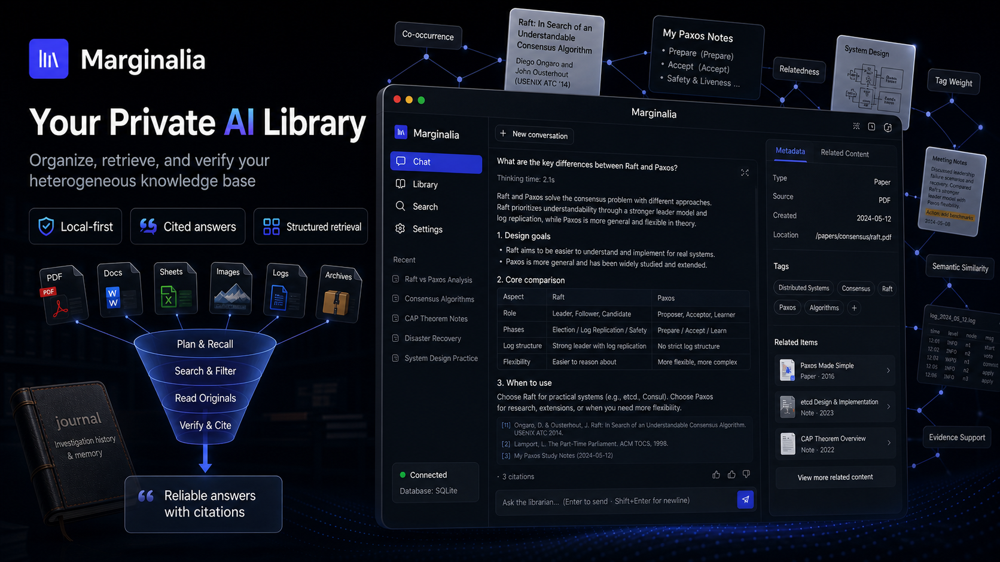

# Marginalia

> Chinese README: [README.zh-CN.md](README.zh-CN.md)
> Detailed design: [DESIGN.md](DESIGN.md)

**Turn your PDFs, notes, spreadsheets, logs, and archives into a private AI
library that answers from original sources.**

Marginalia is a local-first research agent for people with messy private
knowledge bases. It keeps your files in a normal folder tree, builds useful
library metadata around them, and makes the agent read the relevant original
file windows before it writes a cited answer.

[Download desktop app](https://github.com/shenmintao/marginalia/releases) ·
[CLI quickstart](#cli-quickstart) · [Usage guide](USAGE.md) ·
[Design notes](DESIGN.md)



## Why Use It

- You have research papers, meeting notes, PDFs, tables, logs, screenshots, and
  archives that do not fit cleanly into one app.
- You want answers that cite the source material instead of a black-box vector
  search layer over chunks.
- You need both quick lookups and slower investigation-style reports over the
  same private library.
- You want local-first storage: the default `mirror` backend keeps your library
  as readable files under `MARGINALIA_HOME/library`.

## What It Does

- Ingests text, Markdown, PDFs, DOCX, images, spreadsheets, logs, and archives.
- Organizes material with folders, catalogs, tags, views, metadata, journals,
  and relation mining.
- Recalls candidates with lexical search by default, plus optional embeddings,
  `sqlite-vec`, reranking, and source quotas.
- Reads original sections, pages, lines, archive members, or table slices before
  answering.
- Produces cited answers and reports, then writes durable investigation notes
  that future turns can recall.

## Try It

### Desktop App

Download the latest desktop package from
[GitHub Releases](https://github.com/shenmintao/marginalia/releases):

- **Windows**: x64/arm64 installer and portable zip.
- **macOS**: Apple Silicon DMG.
- **Linux**: x64/arm64 `.deb` and `.rpm`.

The desktop builds bundle their own Python runtime. They are currently unsigned,
so Windows SmartScreen or macOS Gatekeeper may ask you to confirm the first
launch.

- **Windows**: click **More info** -> **Run anyway** if SmartScreen blocks the
  first launch.
- **macOS**: after dragging the app to `/Applications`, run
  `xattr -dr com.apple.quarantine /Applications/Marginalia.app` if Gatekeeper
  reports that the app is damaged or cannot be verified.

### CLI Quickstart

Requires Python 3.11+.

```bash
python -m venv .venv

# Windows PowerShell
.\.venv\Scripts\Activate.ps1

# macOS / Linux
source .venv/bin/activate

pip install -e ".[dev]"
marginalia init
```

Edit `.env`:

```ini
LLM_DEFAULT_PROVIDER=openai
LLM_DEFAULT_API_KEY=sk-...
LLM_DEFAULT_MODEL=gpt-4o-mini
```

Run the embedded CLI + API + worker:

```bash
marginalia
```

Then:

```text
marginalia> /upload ./paper.pdf /papers/
marginalia> /background
marginalia> compare this paper with my Paxos notes
marginalia> /export
```

The first launch bootstraps the database schema automatically.

## Example Questions

```text
Compare this Raft paper with my Paxos notes.
Find the incident timeline across the logs and the postmortem.
Which uploaded papers support this claim, and which contradict it?
Summarize the spreadsheet, then cite the rows used for the conclusion.
Turn this folder into a cited research brief.
```

## How It Differs From Plain RAG

Marginalia is not just "retrieve top-k chunks and answer." The agent can recall
prior investigations, inspect structured metadata, follow related entries, read
original source windows, and correct its search path before writing. Quick mode
keeps this bounded for short lookups; Deep mode keeps the full ReAct
investigation loop when coverage matters more than latency.

## The Retrieval Funnel

```text
user question
  -> plan
  -> recall_knowledge            # journal + metadata + optional semantic recall
  -> search_metadata/list_folder # focused follow-up over names, summaries, tags
  -> read_entries_metadata       # sections, extra, related entries
  -> discover/related entries    # graph-based neighbours
  -> read_files                  # original text/page/line/member/table slice
  -> answer with footnotes
  -> reflect_turn                # durable journal memory
```

The agent is instructed to use `recall_knowledge` for broad material location.
That tool resolves tag hints, searches prior journal notes and entry metadata,
optionally adds semantic candidates, ranks the merged pool, and returns compact
candidate IDs for batched metadata verification and source reads. Lower-level
tools such as `search_journal`, `search_metadata`, and `materialize_view`
remain available for focused follow-up and debugging.

## Supported Ingest Pipelines

- `text`: text, Markdown, reStructuredText, code-like text.
- `pdf`: text-layer PDF, long-PDF page windows, PDF page labels, scanned-PDF OCR fallback when a vision profile is configured.
- `image`: image indexing and description when a vision profile is configured.
- `docx`: Word documents.
- `spreadsheet`: CSV, TSV, JSON, XLSX, Parquet and related table formats.
- `log`: logs and logrotate variants.
- `archive`: zip, tar, 7z, rar, gz, bz2, xz, iso, cab and other py7zz-supported containers.

## Retrieval Evaluation

External retrieval datasets can be imported from a local BEIR-style directory:

```text
<dataset>/
  corpus.jsonl
  queries.jsonl
  qrels/test.tsv
```

Import is synchronous. Each corpus document is written as a normal entry and
immediately passed through the ingest pipeline, so the command returns only
after the eval corpus is indexed.

```bash
MARGINALIA_HOME=./runtime/eval/scifact marginalia eval import-beir scifact ./datasets/scifact
MARGINALIA_HOME=./runtime/eval/scifact EMBEDDING_API_KEY=... marginalia eval build-semantic-index scifact
MARGINALIA_HOME=./runtime/eval/scifact marginalia eval run scifact --retriever search_metadata --k 10,50,100 --json report.json
MARGINALIA_HOME=./runtime/eval/scifact marginalia eval run scifact --retriever semantic_recall --k 10,50,100
MARGINALIA_HOME=./runtime/eval/scifact marginalia eval answer scifact --retriever recall_knowledge --query-id <qid> --timeout-seconds 300
MARGINALIA_HOME=./runtime/eval/scifact marginalia eval answer-run scifact --retriever recall_knowledge --qrels-only --query-limit 20 --concurrency 10 --json answer-report.json
MARGINALIA_HOME=./runtime/eval/scifact marginalia eval compare-report scifact --query-limit 30 --concurrency 3 --json compare-report.json
```

Use a dedicated `MARGINALIA_HOME` for external benchmarks unless you
intentionally want benchmark documents inside your personal library.
`eval build-semantic-index` uses the configured embedding provider. The
default is Alibaba Cloud Model Studio / DashScope `text-embedding-v4`; set
`EMBEDDING_API_KEY` before building. Embedding credentials are intentionally
separate from `LLM_*` profiles. Semantic recall is optional and disabled by
default; set `SEMANTIC_RECALL_ENABLED=true` to merge semantic candidates from
the default semantic index with the lexical metadata recall path. The eval CLI
index builder targets imported datasets; the GUI/API can enqueue a whole-library
semantic-index rebuild for the default index after embedding model or dimension
changes. Ingest also refreshes the affected file's semantic vectors after a
successful run when semantic recall is configured. If the optional `sqlite-vec`
dependency is installed, the semantic index also writes `vectors.sqlite` and
search uses it before falling back to the file index. Install with
`pip install -e ".[semantic]"`, or set `SEMANTIC_INDEX_BACKEND=file` to keep
only the file backend.
Optional reranking can refine the merged candidate pool before evidence
selection. Enable it with `RERANK_ENABLED=true`, `RERANK_API_KEY=...`, and
optionally `RERANK_MODEL=qwen3-rerank`. Rerank credentials are also separate
from `LLM_*`; no chat or vision key is reused implicitly. Evidence selection
defaults to `EVIDENCE_SELECTION=quota`; set `EVIDENCE_SELECTION=rerank` to take
the reranked top evidence directly.
The eval report treats `hit@k` and `candidate_recall@k` as the investigation
candidate-pool metrics; MRR and nDCG are ranking-efficiency diagnostics.
`eval answer` is a bounded final-answer probe: it retrieves candidates, reads
limited source text, performs one answer-generation call, and reports whether
the answer cited a qrels-relevant document. `eval answer-run` repeats the same
bounded probe across imported queries and reports aggregate final-answer
citation hit rate; use `--qrels-only` to apply `--query-limit` after filtering
to imported qrels-backed queries and `--concurrency` to run independent answer
probes in parallel. When BEIR query metadata includes SciFact-style
SUPPORT/CONTRADICT labels, the answer report also includes label accuracy.
`eval compare-report` runs a blind end-to-end comparison between a one-shot
RAG report and the full ReAct investigation workflow on the same query set.
When SciFact-style gold labels are available, the judge prioritizes verdict
correctness before report completeness.

Latest local validation on SciFact 300:

- Retrieval with `recall_knowledge` + rerank top-80 reached MRR 0.7226,
  hit@10 0.8800, and hit@100 0.9133.
- Bounded final-answer probes with rerank top-80 and quota evidence selection
  reached evidence hit 0.8667, citation hit 0.7133, and label accuracy 0.8085.
- A 30-query end-to-end report comparison favored the full ReAct workflow over
  one-shot RAG in 26/30 cases, with 2 one-shot RAG wins, 2 ties, and 1 timeout.

These results support Marginalia's current positioning: for quick lookups it
behaves like a hybrid RAG system, while the full ReAct workflow is a slower
deep-investigation path that can produce better source-grounded reports.
They should not be read as a claim of general benchmark SOTA: the dataset is
small, the comparison target is a local one-shot RAG baseline, and final
quality still depends on model behavior, ingest quality, and available
evidence.

## CLI Surface

Slash commands:

```text
/help                         list commands
/upload <local> <remote>      upload a file or directory into the vault
/check                        diff mirror vault vs database
/ingest <path> | --all        sync manual vault edits into the database
/search <query>               metadata recall
/info <entry_id>              entry metadata and preview
/discover <entry_id> [N]      related entries from the evidence graph
/tree                         folder tree
/download <id> [dest]         download file or folder zip
/export [conversation_id]     export answer and citations
/tend                         run a maintenance pass
/background                   show queued/running tasks
/mode [quick|deep]            show or change chat mode
/new / /clear / /quit         session control
```

Any non-slash input is sent to the investigator agent.

## API Surface

Business endpoints live under `/v1`:

```text
POST /v1/upload
GET  /v1/search
GET  /v1/file-entries/{entry_id}/metadata
GET  /v1/file-entries/{entry_id}/content
POST /v1/sessions
POST /v1/chat/{session_id}          # Server-Sent Events
GET  /v1/conversations/{id}/export
POST /v1/tend
GET  /v1/tasks/active
GET  /v1/settings/llm
GET  /health
```

The desktop GUI and CLI both use the same API.

`POST /v1/chat/{session_id}` accepts `{ "query": "...", "mode": "deep" }`
or `{ "query": "...", "mode": "quick" }`. Omit `mode` for the default deep
investigation behavior.

## Configuration

Core `.env` fields:

```ini
MARGINALIA_HOME=~/Marginalia
DB_BACKEND=sqlite                  # sqlite or postgres
STORAGE_BACKEND=mirror             # mirror, local, or s3
WORKER_ENABLED=true
AUTO_LIFECYCLE_ENABLED=false

LLM_DEFAULT_PROVIDER=openai        # openai, openai-compatible, anthropic
LLM_DEFAULT_API_KEY=sk-...
LLM_DEFAULT_BASE_URL=
LLM_DEFAULT_MODEL=gpt-4o-mini

LLM_CHAT_MODEL=
LLM_REFLECT_MODEL=
LLM_INGEST_MODEL=
LLM_VISION_MODEL=

EMBEDDING_API_KEY=
EMBEDDING_BASE_URL=https://dashscope.aliyuncs.com/compatible-mode/v1
EMBEDDING_MODEL=text-embedding-v4
SEMANTIC_RECALL_ENABLED=false
SEMANTIC_INDEX_BACKEND=auto        # auto, file, sqlite-vec

RERANK_ENABLED=false
RERANK_API_KEY=
RERANK_BASE_URL=https://dashscope.aliyuncs.com/compatible-api/v1
RERANK_MODEL=qwen3-rerank
EVIDENCE_SELECTION=quota           # quota or rerank

AGENT_PLAN_MAX_TOKENS=1024
AGENT_EXECUTE_MAX_TOKENS=2048
AGENT_FINAL_ANSWER_CONTINUE_TURNS=3
AGENT_FINAL_ANSWER_MAX_CHARS=120000
```

Use `openai-compatible` for DeepSeek, Together, Groq, local vLLM, Ollama, and other OpenAI wire-compatible services.

The `vision` profile is optional. Without it, image enrichment, PDF figure captioning, and scanned-PDF OCR degrade gracefully or are skipped.

When a long final answer hits the model token limit, Marginalia can continue it server-side and emit one merged answer event to the GUI. Tune `AGENT_FINAL_ANSWER_CONTINUE_TURNS` and `AGENT_FINAL_ANSWER_MAX_CHARS` for research-heavy deployments.

## Storage and Deployment

Default local layout:

```text
<MARGINALIA_HOME>/marginalia.db
<MARGINALIA_HOME>/library/
<MARGINALIA_HOME>/objects/
```

`STORAGE_BACKEND=mirror` stores files as a readable folder tree. `local` stores UUID-addressed objects. `s3` is for multi-host deployments.

Single-process mode:

```bash
marginalia
```

Remote API mode:

```bash
uvicorn marginalia.main:app --host 0.0.0.0 --port 8000
marginalia --server http://server:8000
```

Docker compose starts API, worker, Postgres, and MinIO:

```bash
echo "LLM_DEFAULT_API_KEY=sk-..." > .env
docker compose up -d
```

## Documentation

- [USAGE.md](USAGE.md): operations manual.
- [DESIGN.md](DESIGN.md): data model, retrieval design, task system, invariants.
- [samples/architecture.md](samples/architecture.md): developer architecture overview.
- [docs/LAUNCH.md](docs/LAUNCH.md): launch copy, social preview notes, and community post templates.

## Development

```bash
.\.venv\Scripts\python -B -m pytest tests -q
```

Current tests cover upload, ingest, agent runtime, tool execution, export, task scheduling, PDF/DOCX/image/table/archive pipelines, relation discovery, lifecycle behavior, semantic index fallback, recall/rerank scoring, evaluation commands, and CLI flows.

## Community links
This open-source project is linked with and recognized by the LINUX DO community:

LINUX DO: [https://linux.do/](https://linux.do/)

## License

AGPL-3.0-or-later. See [LICENSE](LICENSE).
