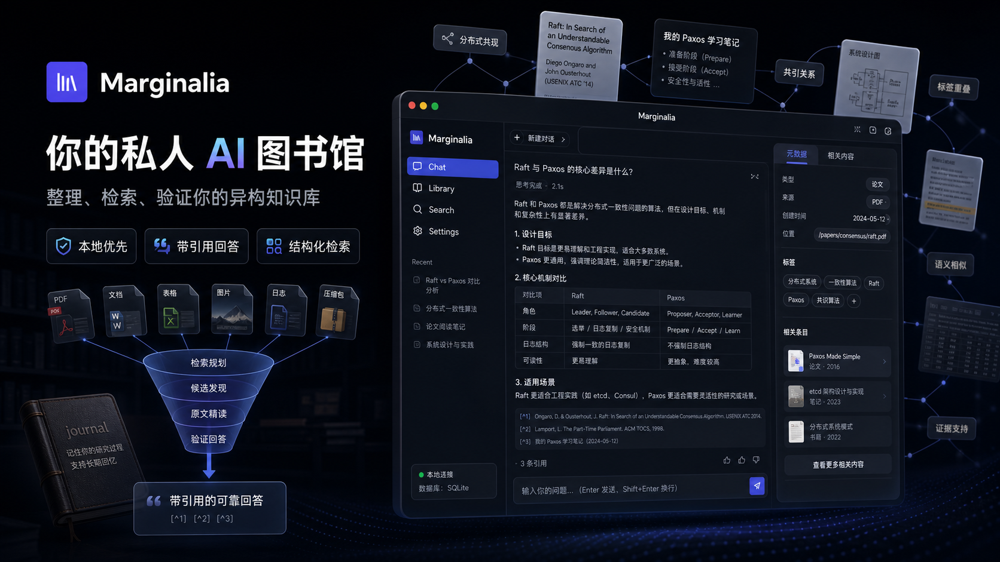

# Marginalia

> English: [README.md](README.md)
> 设计文档: [DESIGN.md](DESIGN.md)

**把你的 PDF、笔记、表格、日志和压缩包变成一个能读原文、会引用来源的私人
AI 图书馆。**

Marginalia 是本地优先的个人研究 agent。它把杂乱的私有文件整理成一个可
检索、可追溯的知识库:文件仍然放在普通文件夹里,AI 负责编目、打标签、
建立关联;你提问时,agent 会先找材料,再读原文片段,最后给出带引用的回答。

[下载桌面应用](https://github.com/shenmintao/marginalia/releases) ·
[CLI 快速开始](#cli-快速开始) · [使用手册](USAGE.zh-CN.md) ·
[设计文档](DESIGN.md)



## 适合谁

- 你有很多 PDF、笔记、Office 文档、图片、表格、日志和压缩包,但它们分散
  在不同文件夹里。
- 你不想再把所有东西切块后丢进一个黑盒向量库,而是希望答案能回到原文。
- 你需要既能快速查找,也能做更慢但更完整的溯源式研究报告。
- 你想让本地文件保持可读、可备份、可迁移,而不是被锁进某个云端系统。

## 它能做什么

- 入库 text、Markdown、PDF、DOCX、图片、表格、日志和常见压缩包。
- 用文件夹、catalog、tag、view、metadata、journal 和关系挖掘组织材料。
- 默认走词法召回;需要时可开启 embedding、`sqlite-vec`、rerank 和证据配额。
- 回答前读取原文的章节、页码、段落、行号、压缩包成员或表格切片。
- 输出带引用的回答和报告,并把每轮调查写回 journal,供后续问题复用。

## 立即试用

### 桌面应用

[Releases 页面](https://github.com/shenmintao/marginalia/releases) 提供桌面包:

- **Windows**: x64/arm64 安装包和 portable zip。
- **macOS**: Apple Silicon DMG。
- **Linux**: x64/arm64 `.deb` 和 `.rpm`。

每个包都内置 Python 运行时,无需系统 Python。当前二进制还没有代码签名,
所以 Windows SmartScreen 或 macOS Gatekeeper 第一次打开时可能会要求手动
确认。

- **Windows**: 如果 SmartScreen 拦截,点 **更多信息** -> **仍要运行**。
- **macOS**: 把 App 拖到 `/Applications` 后,如果提示 App 已损坏或无法验证,
  运行 `xattr -dr com.apple.quarantine /Applications/Marginalia.app`。

### CLI 快速开始

```bash
python -m venv .venv

# Windows PowerShell
.\.venv\Scripts\Activate.ps1

# macOS / Linux
source .venv/bin/activate

pip install -e ".[dev]"
marginalia init
```

编辑 `.env`:

```ini
LLM_DEFAULT_PROVIDER=openai
LLM_DEFAULT_API_KEY=sk-...
LLM_DEFAULT_MODEL=gpt-4o-mini
```

启动内嵌 CLI + API + worker:

```bash
marginalia
```

然后:

```text
marginalia> /upload paper.pdf /
marginalia> 比较一下 raft 和 paxos
```

`marginalia` 命令是单进程——server / worker / CLI 全在里面,不需要开
第二个终端。第一次启动会自动初始化数据库 schema,不需要手动跑 migration。

默认你的文件以真实文件夹形式存在 `~/Marginalia/library/...` 下。可以
在 Finder 里浏览、用 `rsync` / `git` 备份、用任何编辑器修改——库就是
你的文件夹,marginalia 只负责索引。在 marginalia 之外改了文件后,跑
`/check` 看 diff,`/ingest --all` 同步。

`MARGINALIA_HOME=/some/path` 把整个目录(db + library + cache)挪到
任意位置。

## 可以这样问

```text
比较一下这篇 Raft 论文和我的 Paxos 笔记。
从日志和复盘文档里整理事故时间线。
哪些上传的论文支持这个结论,哪些反对?
总结这个表格,并标出结论用到了哪些行。
把这个文件夹整理成一份带引用的研究简报。
```

## 和普通 RAG 的区别

Marginalia 不只是“取 top-k chunk 然后回答”。它会先用 journal、文件夹、
catalog、tag、view、metadata 和 `recall_knowledge` 缩小范围,再按需合并
词法召回、可选 embedding 召回、RRF 风格打分、可选 rerank 和 evidence 配额。
最后 agent 会读取原文窗口,而不是只依赖预切 chunk。

短问题可以走**快速**模式;需要覆盖率和交叉验证的问题可以走**深入**模式,
保留完整 ReAct 调查循环。

## 它怎么工作

三个角色分工:

- **图书馆员**: 离线批处理。入册新文件、归并同义 tag、重整 catalog。
- **调查员**: 在线 agent。Plan -> 工具调用 -> 读原文 -> 带引用的答案。
- **你**: 上传、整理文件夹、归档、删除。库是你的;AI 的工作产物独立存放。

调查员的笔记本是真的一张表(`journal`),图书馆员后续重整时会读它。这个
反馈回路让库越用越懂你的材料。

## CLI

`marginalia` 是 Claude-Code 风格的 REPL。`/` 开头是 slash 命令,其他
内容直接发给 agent。

```
/help                           列出所有命令
/upload <local> <remote>        从外部拷文件进库
/check                          对比磁盘和 db(只读)
/ingest <vault_path>            同步单个文件
/ingest --all                   同步整个库
/discover <entry_id> [N]        查看语料库为它链接到的 entry
/tree                           文件夹树
/ls [parent_id]                 列文件夹
/cd <path>                      切换"远端 cwd"(用于相对路径上传)
/search <query>                 按文件名 + summary 召回
/info <entry_id>                查看 entry 的用户可见 metadata + summary
/download <entry_id|folder_id>  文件 → 字节;文件夹 → zip
/export [<conv_id>]             把对话 + 引用打包成 zip
/mode [quick|deep]              查看或切换 chat 模式
/clear  /  /new                 结束 / 开始 chat session
/quit
```

一次对话 turn 渲染成事件流:

```
marginalia> 比较一下 raft 和 paxos
⠋ planning the investigation...
⠋ calling recall_knowledge(text=["raft", "paxos"])
⠋ calling read_files(entry_id=...)
⠋ investigator thinking...
✓ answer ready

# Raft vs Paxos
Raft 把 Paxos 拆成三个相对独立的子问题……
[^a]: entry_id=...

  [tokens in=3300 out=340 tools=2 llm_calls=3 4521ms]
```

## 架构

**14 张表,4 层**:

```
audit_events                — 事件流(90 天滚动)
sessions / conversations    — 容器 + 累计指标
catalogs / views / tags /   — AI 内部:图书馆员的工作知识
  tag_aliases / entry_tags /  (用户看不到这层)
  entry_relations / journal
folders / file_entries /    — 用户可见
  files
tasks / task_outcomes       — 基础设施
```

**任务队列 + ReAct 工具 + 8 条 ingest pipeline**:

- text / pdf(含扫描件 OCR via VLM)/ image(VLM 缩放)
- docx / spreadsheet / log(含 logrotate 变种)
- archive(zip / tar.* / 7z / rar / .gz / .bz2 / .xz / iso / cab,50+ 种 via py7zz)

### 混合召回

调查员现在优先用 `recall_knowledge` 做宽召回:

```
用户问题
  → recall_knowledge
      → resolve_tag
      → search_journal
      → search_metadata(tags/text)
      → 可选 semantic recall
      → RRF 风格合并打分
      → 可选 rerank
      → quota 或 rerank evidence selection
  → read_entries_metadata
  → read_files
  → 带引用答案
```

embedding 和 rerank 都是可选能力,不会隐式复用 chat / vision / ingest 的
API key。默认 embedding 配置面向百炼/DashScope 的 `text-embedding-v4`;
如果安装 `sqlite-vec`,semantic index 会额外写入 `vectors.sqlite`,否则走文件
索引 fallback。当前公开 CLI 的 semantic index 构建命令主要服务 eval 数据集;
普通库可在 GUI/API 中排队重建默认 semantic index,用于更换 embedding 模型或
维度后的全量重嵌入。ingest 成功后也会在 semantic recall 已配置时刷新该文件的
semantic 向量。

### 评测结论

最新本地 SciFact 评测支持这个方向,但不把它包装成通用 SOTA:

- 300 条 retrieval,`recall_knowledge` + rerank top-80: MRR 0.7226,
  hit@10 0.8800,hit@100 0.9133。
- 300 条 bounded answer-run,rerank top-80 + quota: evidence hit 0.8667,
  citation hit 0.7133,label accuracy 0.8085。
- 30 条端到端报告对比:ReAct 赢 26 条,one-shot RAG 赢 2 条,平 2 条,
  timeout 1 条。

结论是:Marginalia 可以宣传为“个人图书馆研究报告场景很强”,尤其适合需要
溯源、引用和多步调查的问题;但完整 ReAct 流程有更高延迟和模型调用成本。

### Discovery(减少 agent 循环次数)

调查员一旦找到一个相关 entry,discovery 层立即把可能的邻居塞给它——
下一步不需要再烧一轮 search + read_files。三个 miner + 一个 LLM 关卡
喂养 `entry_relations`;random walk 服务消费 vetted 后的图;结果预填
进 search 和 metadata 响应。

```
mine_session_cooccurrence    journal 里 X 和 Y 在同一对话中被提及
mine_tag_overlap             Jaccard ≥ 0.30 且共享 ≥ 2 个 tag
mine_citation_graph          X 和 Y 在同一 agent 答案中被同时引用
                ↓
       entry_relations(原始,带 source_kind)
                ↓
   vet_relations              LLM 关卡,逐对判断 → vetted=True/False
                ↓
       entry_relations.vetted=True(干净的图)
                ↓
   services.recommend.find_related   带重启的 random walk,alpha=0.15
                ↓
   /discover <entry_id>            CLI 入口
   search/get_metadata.related_entries   预填 top-3 / top-8
```

Miner + vet 由 periodic dispatcher 驱动(默认每天;`/tend` 也会触发)。
Random walk 是查询时的只读操作。

完整设计见 [`DESIGN.md`](DESIGN.md)。

## API

业务 endpoint 全在 `/v1/`:

```
POST /v1/upload                        上传文件
GET  /v1/folders                       文件夹树
GET  /v1/file-entries/{id}/...         单文件操作
GET  /v1/search                        metadata 召回
POST /v1/sessions                      开 chat session
POST /v1/chat/{session_id}             chat(SSE 流)
POST /v1/sessions/{id}/close
GET  /v1/conversations/{id}/export     导出对话 zip
GET  /health                           liveness probe(无版本)
```

`POST /v1/chat/{session_id}` 返回 `text/event-stream`。事件:
`conversation` / `planning` / `plan` / `thinking` / `tool_call` /
`tool_result` / `answer` / `error` / `done`。CLI 状态机就是按这些事件
渲染的。

请求体支持 `{ "query": "...", "mode": "deep" }` 或
`{ "query": "...", "mode": "quick" }`;省略 `mode` 时默认走深入调查。

## 配置

`.env`:

```ini
MARGINALIA_HOME=~/Marginalia     # 一个根目录;db + library + objects 都在这下面
DB_BACKEND=sqlite                # 或 postgres

STORAGE_BACKEND=mirror           # 默认。文件以可读文件夹形式存:
                                 #   <home>/library/research/llm/paper.pdf
                                 # 备选:'local'(UUID 扁平,dedup,
                                 # 高频改写场景快约 5 倍)/ 's3'

WORKER_ENABLED=true              # embedded 模式默认开

LLM_DEFAULT_PROVIDER=openai      # openai / openai-compatible / anthropic
LLM_DEFAULT_API_KEY=sk-...
LLM_DEFAULT_BASE_URL=
LLM_DEFAULT_MODEL=gpt-4o-mini
LLM_REFLECT_MODEL=gpt-4o
LLM_VISION_MODEL=gpt-4o

EMBEDDING_API_KEY=
EMBEDDING_BASE_URL=https://dashscope.aliyuncs.com/compatible-mode/v1
EMBEDDING_MODEL=text-embedding-v4
SEMANTIC_RECALL_ENABLED=false
SEMANTIC_INDEX_BACKEND=auto      # auto / file / sqlite-vec

RERANK_ENABLED=false
RERANK_API_KEY=
RERANK_BASE_URL=https://dashscope.aliyuncs.com/compatible-api/v1
RERANK_MODEL=qwen3-rerank
EVIDENCE_SELECTION=quota         # quota / rerank

AGENT_PLAN_MAX_TOKENS=1024
AGENT_EXECUTE_MAX_TOKENS=2048
AGENT_FINAL_ANSWER_CONTINUE_TURNS=3
AGENT_FINAL_ANSWER_MAX_CHARS=120000

MARGINALIA_SERVER=               # 非空 = 远程模式,跳过 embedded
```

OpenAI 兼容 endpoint(Together / Groq / DeepSeek / 本地 vLLM / ollama)
通过 `LLM_*_BASE_URL` 切换。

长调研答案如果在最终回答阶段撞到模型 token 上限,运行时会在服务端续写,
GUI 仍然只收到一个合并后的 `answer` 事件。可用
`AGENT_FINAL_ANSWER_CONTINUE_TURNS` 和 `AGENT_FINAL_ANSWER_MAX_CHARS`
调节续写轮数与最终答案字符上限。

## 部署形态

**默认(embedded)**:`marginalia` 在自己进程里挂 FastAPI + TaskRunner。
HTTP 不经过 socket——`httpx.ASGITransport` 直接调 ASGI app。99% 场景
应该用这个。

```
   ┌──────────────────────────────────────┐
   │  marginalia  (CLI + ASGI + worker)   │
   └──────────────────────────────────────┘
```

**多机部署**(可选):server 拆成独立进程,CLI 通过 HTTP 连。SQLite
同时只允许一个写进程——多机部署用 Postgres。

```
   ┌─────────────┐         ┌──────────────────┐
   │  marginalia │   HTTP  │  uvicorn server  │
   │     CLI     ├────────►│  marginalia.main │  (WORKER_ENABLED=true)
   └─────────────┘         └────────┬─────────┘
                                    │  共享 Postgres + storage
```

```bash
uvicorn marginalia.main:app --host 0.0.0.0 --port 8000
marginalia --server http://server.lan:8000
# 或写入持久配置: MARGINALIA_SERVER=http://server.lan:8000 -> ~/.marginalia/.env
```

### Docker

`docker-compose.yml` 启动 api + worker + Postgres + MinIO:

```bash
echo "LLM_DEFAULT_API_KEY=sk-..." > .env
docker compose up -d
marginalia --server http://localhost:8000
```

Compose 在 api 启动时跑 `alembic upgrade head`,通过一次性 init
容器创建 MinIO bucket。卷(`pgdata` / `miniodata` / `margdata`)
跨重启持久化。

## 文档

- [USAGE.zh-CN.md](USAGE.zh-CN.md): 使用和运维手册。
- [DESIGN.md](DESIGN.md): 数据模型、检索设计、任务系统和关键不变量。
- [docs/LAUNCH.md](docs/LAUNCH.md): 宣传文案、social preview 和社区发帖模板。

## 开发

```bash
.venv/Scripts/python tests/test_agent_e2e.py
for t in tests/test_*_e2e.py; do .venv/Scripts/python "$t"; done
```

测试覆盖 upload / ingest / reflect / dispatcher / lifecycle / restructure /
agent runtime / agent tools / CLI / image / pdf / pdf-OCR / docx /
spreadsheet / container / git / archive pipeline / mirror 存储 /
scan + sync / discovery / semantic index fallback / recall-rerank scoring /
eval 命令等路径。

## License

Copyright (c) 2026 shenmintao

AGPL-3.0-or-later。完整条款见 [LICENSE](LICENSE)。

如果你以网络服务的形式运行修改过的 Marginalia,AGPL 要求你向你的用户
公开对应源码。
